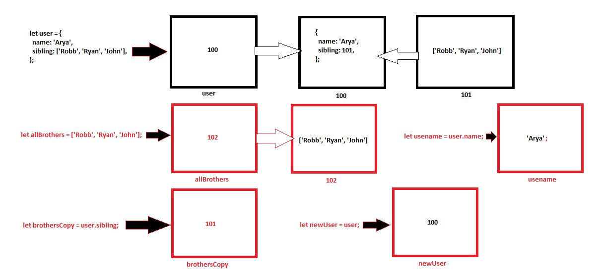

```js
let user = {
  name: 'Arya',
  sibling: ['Robb', 'Ryan', 'John'],
};
let allBrothers = ['Robb', 'Ryan', 'John'];
let brothersCopy = user.sibling;
let usename = user.name;
let newUser = user;
```

1. Memory representation

- Create the memory representation of the above snippet on notebook.
- Take a photo/screenshot and add it to the folder `code`

<!-- To add this image here use  -->


2. Answer the following with reason:

- `user == newUser;` // true 
- `user === newUser;` // true
- `user.name === newUser.name; // true`
- `user.name == newUser.name;` // true
- `user.sibling == newUser.sibling;`// true
- `user.sibling === newUser.sibling;` // true
- `user.sibling == allBrothers;` // false because it wil create a new address
- `user.sibling === allBrothers;` // false because it wil create a new address
- `brothersCopy === allBrothers;` // false both wil have different adress location as 101 & 102
- `brothersCopy == allBrothers;` // false both wil have different adress location as 101 & 102
- `brothersCopy == user.sibling;` // true
- `brothersCopy === user.sibling;` // false both wil have different adress location as 101 & 102
- `brothersCopy[0] === user.sibling[0];` // false because both may have "rob" as key value but they both are from different address.
- `brothersCopy[1] === user.sibling[1];` // false because both may have "Ryan" as key value but they both are from different address.
- `user.sibling[1] === newUser.sibling[1];` // true 
