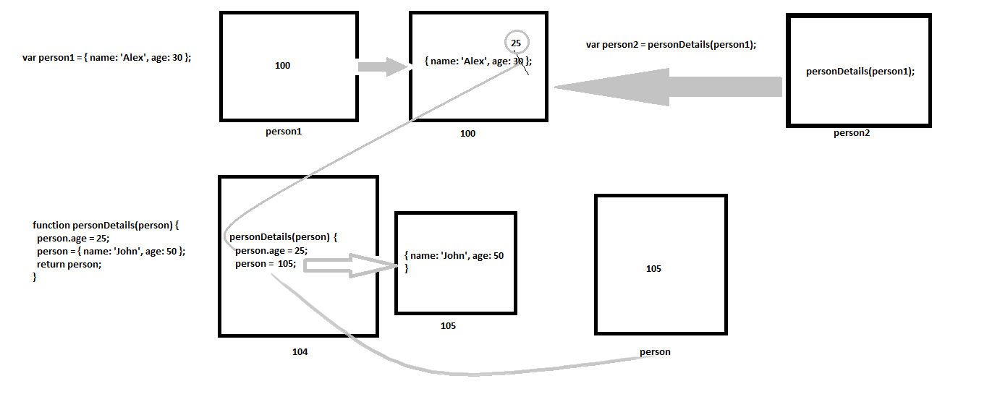

1. What will be the output and explain the reason.

```js
let obj = { name: 'Arya' };
obj = { surname: 'Stark' };
let newObj = { name: 'Arya' };
let user = obj;
let arr = ['Hi'];
let arr2 = arr;
```

Answer the following with reason after going through the above code:

- `[10] === [10]` // false
- What is the value of obj? // { surname: 'Stark' };
- `obj == newObj` // false
- `obj === newObj` // false
- `user === newObj` // false
- `user == newObj` // false
- `user == obj` // true
- `arr == arr2` // true
- `arr === arr2` // true

2. What's will be the value of `person1` and `person2` ? Explain with reason. Draw the memory representation diagram.

<!-- To add this image here use  -->

```js
function personDetails(person) {
  person.age = 25;
  person = { name: 'John', age: 50 };
  return person;
}
var person1 = { name: 'Alex', age: 30 };
var person2 = personDetails(person1);
console.log(person1); // { name: 'Alex', age: 25 };
console.log(person2); // { name: 'John', age: 50 };
```
Initially person1 will contain `{ name: 'Alex', age: 30 };` in address 100, but after execution of ``var person2 = personDetails(person1);`` the value of age will be changed to age 25 from 30 due to ``person.age = 25;`` called in the function. This wil remain same when we will print the value of person1 with address 100, being a non-primitive vale this value will be mutated and will remain same.

3. What will be the output of the below code:

```js
var brothers = ['Bran', 'John'];
var user = {
  name: 'Sansa',
};
user.brothers = brothers;
brothers.push('Robb');
console.log(user.brothers === brothers); //1. true
console.log(user.brothers.length === brothers.length); //2. true
```
